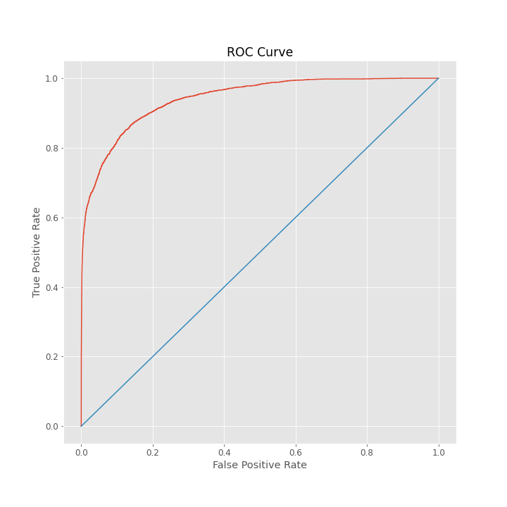

# IEEE CIS Credit Card Fraud Detection

### Author: Alvaro Henriquez
## Introduction
In this project the goal is to create a classification model that can accurately predict fraudulant online credit card transaction. For this purpose we use a very large dataset provided by the **Vesta Corporation** in partenership with the **IEEE Computaional Inteligence Society**. **Vesta** is the world's leading payment service company. The data comes from Vesta's real-world e-commerce transactions and includes 433 features. Many of these features have been engineered by Vesta's team.
## The Data
The dataset was supplied by **Vesta Corporation**, the forerunner in guaranteed e-commerce payment solutions. The dataset can be downloaded from [Kaggle](https://www.kaggle.com/c/ieee-fraud-detection/data?select=test_transaction.csv). It is not hosted in this repository as the file sizes are too large.
## The Code
The code can be found in the `src` directory. There you will find `preprocess.py`
## Requirements

```python
import warnings
warnings.filterwarnings("ignore")

from numba import jit
import numpy as np # linear algebra
import pandas as pd # data processing, CSV file I/O (e.g. pd.read_csv)
import scipy as sp
from scipy import stats
import matplotlib.pyplot as plt
import seaborn as sns
import datetime
import graphviz

from tqdm import tqdm_notebook
from sklearn.preprocessing import LabelEncoder
from sklearn.model_selection import StratifiedKFold, KFold, TimeSeriesSplit, train_test_split
from sklearn.metrics import roc_auc_score
from sklearn.tree import DecisionTreeClassifier
from sklearn import tree
import lightgbm as lgb
import xgboost as xgb
from catboost import CatBoostClassifier, Pool
from scipy.stats import ks_2samp
from scipy.stats.mstats import gmean

from tqdm import tqdm_notebook as tqdm
from IPython.display import display

import os
import gc
import random
```
## Example from the project
**LightGBM ROC_CURVE**

**CatBoost ROC_CURVE**

## Recources
[Cost Sensitive Credit Card Fraud Detection using Bayes Minimum Risk](https://albahnsen.files.wordpress.com/2018/05/cost-sensitive-credit-card-fraud-detection-using-bayes-minimum-risk-publish.pdf)<p></p>
[Feature engineering strategies for credit card fraud detection](https://albahnsen.github.io/files/Feature%20Engineering%20Strategies%20for%20Credit%20Card%20Fraud%20Detection_published.pdf)<p></p>
[IEEE-CIS Fraud Detection - Data Description (Details and Discussion)](https://www.kaggle.com/c/ieee-fraud-detection/discussion/101203#588953)<p></p>
